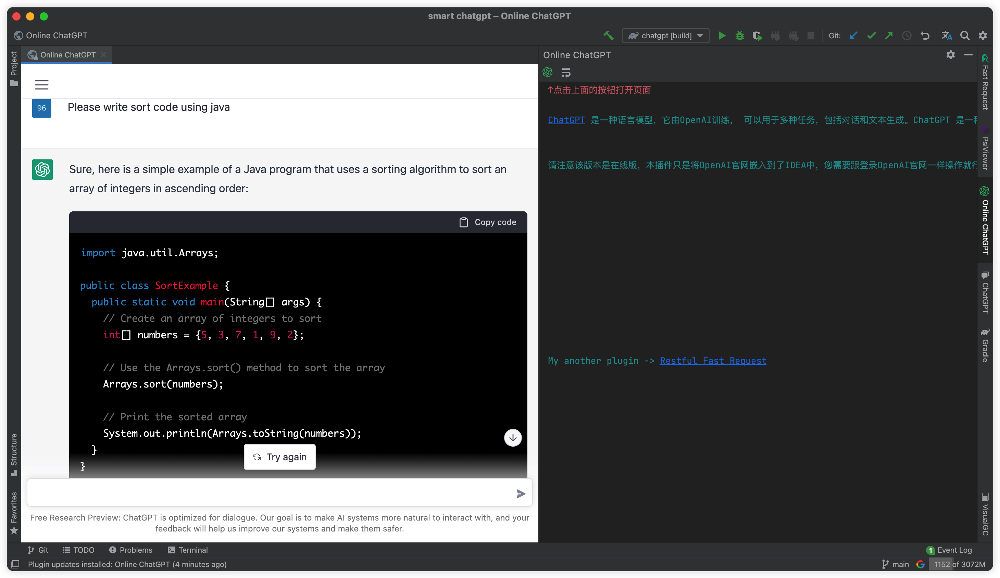

# smart-chatgpt
Intellij IDEA plugin for chatgpt

[ChatGPT](https://chat.openai.com/chat) is a language model trained by OpenAI and can be used for a variety of tasks, including dialogue and text generation. ChatGPT is a neural network-based model that is trained on large amounts of human language data and is able to generate natural language text that is meaningful in a given context. The model can be used for many applications, such as natural language processing (NLP) and dialogue systems.\n\n\n

